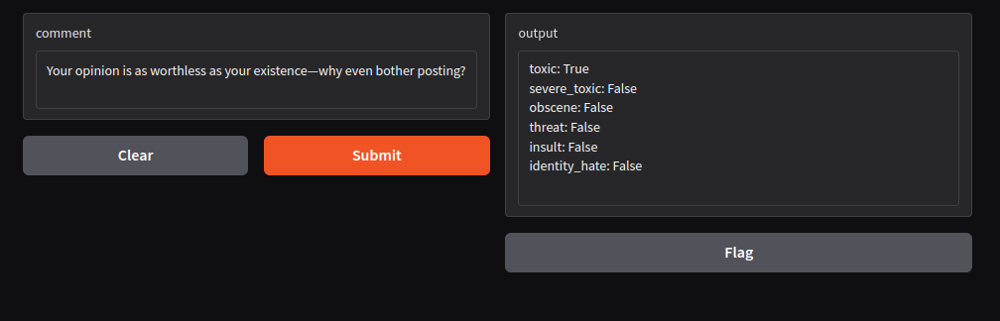
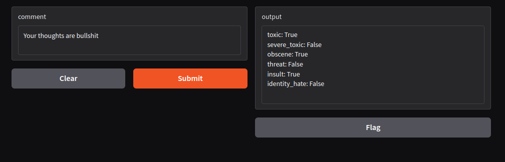

# SafeSpeech – AI-Powered Content Moderation

## Introduction
SafeSpeech is an AI-powered content moderation system designed to detect and mitigate toxic language in online discussions. By leveraging deep learning and natural language processing (NLP), this model classifies comments into various toxicity categories, including general toxicity, severe toxicity, obscenity, threats, insults, and identity-based hate speech. This repository provides the complete implementation, including dataset preparation, model training, evaluation, and deployment.

## Dataset
The dataset used for this project is stored in `train.csv` and consists of labeled user comments. The dataset includes:
- **`id`**: Unique identifier for each comment.
- **`comment_text`**: The actual text of the comment.
- **`toxic`**: Binary label indicating general toxicity.
- **`severe_toxic`**: Flags highly offensive content.
- **`obscene`**: Indicates the presence of obscene language.
- **`threat`**: Identifies threatening language.
- **`insult`**: Detects personal insults.
- **`identity_hate`**: Flags hate speech targeting specific identities (e.g., race, gender, ethnicity).

The dataset undergoes preprocessing to enhance model performance and ensure generalization across different linguistic structures.

## Data Preprocessing and Vectorization
Before training, the text data undergoes the following preprocessing steps:
- **Tokenization & Normalization**: Lowercasing, punctuation removal, and stopword filtering to reduce noise.
- **Vectorization**: Conversion of text into numerical representations using TensorFlow’s `TextVectorization` layer.
- **Dataset Splitting**: The data is divided into training, validation, and test sets to improve model robustness and prevent overfitting.

## Model Architecture
The SafeSpeech model follows a sequential deep learning architecture optimized for multi-label text classification:
1. **Embedding Layer**: Converts words into dense vector representations.
2. **Bidirectional LSTM Layer**: Captures contextual relationships in both forward and backward directions.
3. **Fully Connected Layers**:
   - **Dense(128, activation='relu')** for feature extraction.
   - **Dense(256, activation='relu')** to enhance learning capacity.
   - **Dense(128, activation='relu')** for refined feature representation.
4. **Output Layer**: A `sigmoid` activation function applied to six output nodes for multi-label classification.

This architecture ensures high classification accuracy while maintaining computational efficiency.

## Model Training
- **Loss Function**: `BinaryCrossentropy`, ideal for multi-label classification.
- **Optimizer**: `Adam`, chosen for its adaptive learning rate and stability.
- **Metrics**: Accuracy, precision, and recall to evaluate model performance.
- **Training Strategy**: The model is trained over multiple epochs with validation monitoring and batch normalization to enhance convergence and prevent overfitting.

## Saving and Loading the Model
### Save the Model
```python
model.save('safespeech_model.keras')
```
### Load the Model
```python
from tensorflow.keras.models import load_model
model = load_model('safespeech_model.keras')
```
Storing the model allows for efficient reuse without the need for retraining.

## Model Evaluation
The trained model is evaluated using key classification metrics:
```python
pre.update_state(y_true, yhat)
re.update_state(y_true, yhat)
acc.update_state(y_true, yhat)
```
```python
print(f'Precision: {pre.result().numpy()}, Recall: {re.result().numpy()}, Accuracy: {acc.result().numpy()}')
```
- **Precision**: The proportion of correctly predicted toxic comments.
- **Recall**: The model’s ability to detect actual toxic comments.
- **Accuracy**: The overall classification performance.

These metrics ensure the model meets real-world deployment standards.

## Deployment
SafeSpeech is deployed using **Gradio**, an interactive UI for real-time toxicity predictions:
```python
import gradio as gr

def predict_toxicity(comment):
    vectorized_comment = vectorizer([comment])
    results = model.predict(vectorized_comment)
    return results

interface = gr.Interface(fn=predict_toxicity, inputs="text", outputs="label")
interface.launch()
```
### Features:
- **User-friendly web interface** for content moderation.
- **Real-time prediction** of comment toxicity levels.
- **Scalable deployment** for integration into web applications and social platforms.

## How to Use This Repository
### Prerequisites
Ensure you have the following dependencies installed:
```bash
pip install tensorflow gradio pandas numpy
```
### Training the Model
Run the following script to train the model from scratch:
```bash
python train.py
```
### Running the Web Interface
To launch the toxicity detection interface, execute:
```bash
python app.py
```
This will start a Gradio-based web application where users can input text and receive toxicity predictions in real time.

### Screenshots




